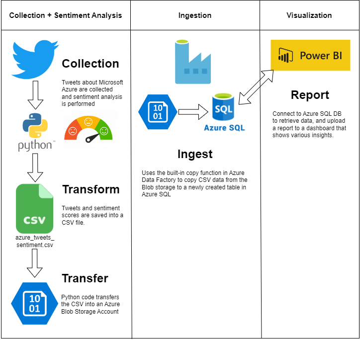

# TweetSentimentAnalyzer
Python script that performs sentiment analysis on tweets.
  * Retrieves 100 tweets about a certain topic.
  * Removes stop words and unwanted text such as URLs and emojis from the tweets.
  * Performs sentiment analysis.
  * Stores tweets and assigned sentiment value in a CSV file.
  * Uploads CSV file to a Microsoft Azure Blob Storage account.

## Tweets Retrieval
The code retrieves 100 tweets about Microsoft Azure, however, the number of tweets and the topic can be changed depending on use case.

## Authentication for Microsoft Azure Blob Storage and Twitter API
Replace the following information:
* Azure
  * connect_str
  * container_name
* Twitter
  * consumer_key
  * consumer_secret
  * access_token
  * access_token_secret

## Architecture
This code is used as part of the following architecture:

